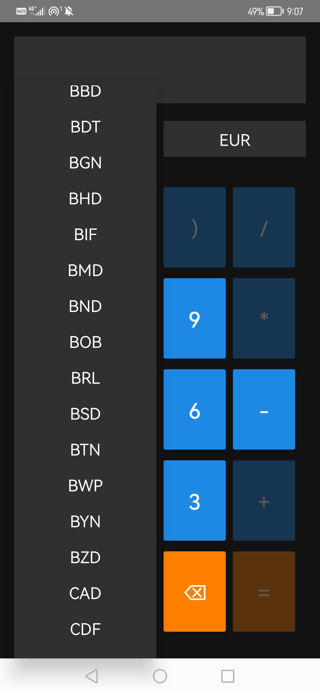
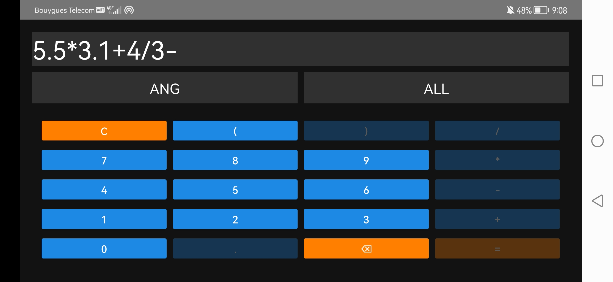

# Currency Conversion Calculator

## Description

Imagine yourself in a supermarket in a foreign country, trying to figure out the value of your shopping basket in Euros (or your home currency). This application allows you to calculate the value of your basket by converting the total from the local currency to your preferred currency.

This calculator is designed to simplify currency conversion and large-scale calculations, offering the following features:

- **Currency Conversion**: Convert values between more than 160 currencies worldwide.
- **Error Prevention**: A system that prevents user errors by blocking invalid button presses.
- **Large Number Calculations**: Perform basic calculations on extremely large numbers, limited only by your device’s physical RAM and swap memory (no logical limitations).

With this app, you'll have an accurate, user-friendly tool to calculate and convert values effortlessly, whether for shopping abroad or any other purpose requiring currency conversions.


## Dependencies

**All dependencies are included in the Gradle build; the following is for your information:**

- **junit:4.13.2**: Used for testing the application.
- **mockito-core:5.5.0**: Helps isolate different parts of the application during testing.
- **guava:32.1.2-jre**: A Google library that provides efficient cache management.
- **gson:2.10.1**: A library for parsing JSON files.
- **mXparser:5.2.0**: A library that includes calculation logic for the calculator's operations.


## Build

This project is compiled with **Android 34 SDK**.

To build this project, you have two options:

### 1. Android Studio (Recommended)
- Open the project in **Android Studio**.
- Click the **Build** button to compile the project.

### 2. Gradle and Command Line
- Navigate to the project’s root directory.
- Run the following command in your terminal:

```bash
./gradlew build
```

## Run

### After Building
Once the project is built, you can deploy it to your phone and run the application.

### Without Building
If you don't want to build the project yourself, you can find the pre-built `.apk` file in the **`release`** folder located at the root of the project. Simply transfer this file to your phone and install it to run the application.


## Features

1. **Multi-Currency Conversion**: Supports over 160 currencies globally.
2. **Error-Free Input**: Prevents errors through button restriction, ensuring accurate results.
3. **Large Number Handling**: Capable of calculating with massive numbers, leveraging your device's full hardware potential.
4. **Intuitive Design**: A user-friendly interface designed for seamless use, even for complex calculations.
5. **Optimized Performance**:
   - Utilizes a **caching system** to store frequently accessed data temporarily.
   - Integrates a **local database** to save currency rates and limit the number of API calls required.
   - Ensures faster responses and reduces the need for constant internet connectivity.


## Screenshots

<p align="center">
     
    &nbsp; &nbsp; &nbsp; &nbsp;
    
</p>

<p align="center">
    
</p>

<p align="center">

</p>

## Permissions

The application requires the following permissions:

- **Read and Write Access to External Storage**: Used for saving data to the database and managing local configuration files.
- **Full Network Access**: Necessary for making API calls to retrieve exchange rates for the selected currencies.


## License

This project is licensed under the MIT License. You are free to use, modify, and distribute this software in accordance with the license terms.
